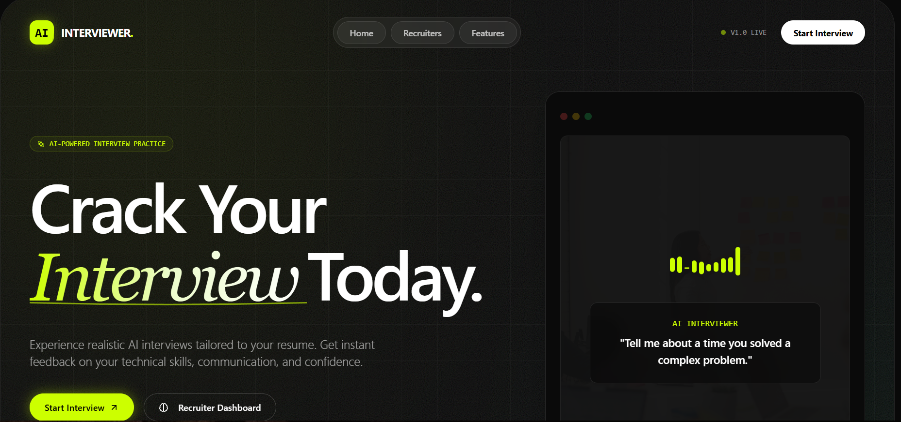
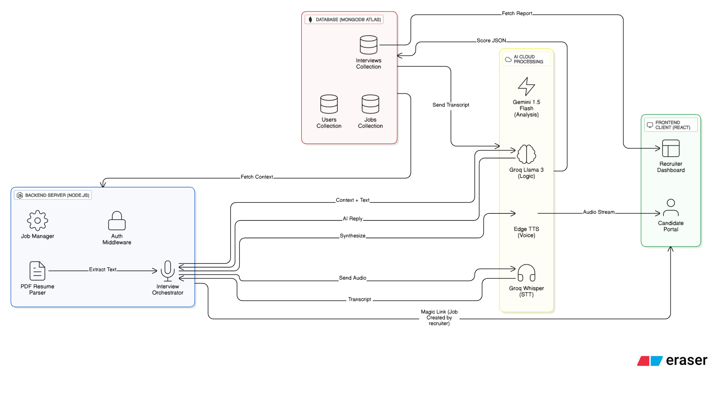

## 🎥 Project Demo

[](https://drive.google.com/file/d/1de49t3RFGYE0YB3NwL_TerQmz_UzUVfr/view)

_Click the image above to watch the full demo._

# 🤖 AI Interviewer

**AI-powered interview platform that helps candidates practice and improve their interview skills through realistic, personalized mock interviews.**

---

## 📋 Problem Statement

Finding the right interview preparation is hard. Most candidates struggle because:

-   They don't get realistic feedback on their performance
-   Mock interviews are expensive or not available
-   They can't practice tailored questions for specific job roles
-   They lack confidence going into real interviews
-   They don't know which areas need improvement (communication, technical skills, confidence)

This leads to poor interview performance and missed job opportunities.

---

## 💡 Proposed Solution

**AI Interviewer** is an intelligent mock interview platform that:

-   Conducts realistic, voice-based interviews tailored to specific job roles
-   Provides instant, detailed feedback on technical skills, communication, and confidence
-   Lets recruiters create custom interviews and view candidate performance
-   Helps candidates practice unlimited times and track improvement
-   No expensive interview coaches needed - just AI-powered practice

---

## 🎯 System Goals

**What We Want to Achieve:**

-   ✅ Enable candidates to practice interviews anytime, anywhere
-   ✅ Give recruiters easy access to candidate performance data
-   ✅ Provide accurate, actionable feedback on interview performance
-   ✅ Create a seamless, voice-based interview experience
-   ✅ Build a scalable platform that handles multiple concurrent interviews

**What We Don't Focus On:**

-   ❌ Replacing real interviews (this is practice only)
-   ❌ Video/camera recording (not in current scope)
-   ❌ Resume parsing from images (PDF only)
-   ❌ Multi-language support (English only for now)

---

## 🏗️ System Components

### **Frontend (React + Tailwind CSS)**

-   **Interview Room** - Where candidates speak and get AI responses
-   **Report Card** - Shows scores and detailed feedback after interview
-   **Recruiter Dashboard** - Lists all candidates who completed interviews
-   **Job Creation Page** - Recruiters create interview sessions
-   **Resume Upload** - Candidates upload their PDF resume

### **Backend (Node.js + Express)**

-   **Interview Orchestrator** - Manages the flow of conversations
-   **PDF Parser** - Extracts text and data from resumes
-   **Groq API Integration** - Powers the AI interviewer (text generation + speech-to-text)
-   **Edge TTS** - Converts AI responses to voice
-   **Database Manager** - Stores interviews and results

### **Database (MongoDB)**

-   **Users Collection** - Recruiter and candidate info
-   **Jobs Collection** - Interview templates created by recruiters
-   **Interviews Collection** - Completed interviews and scores

### **External Services**

-   **Groq Llama 3** - AI model for interview logic
-   **Groq Whisper** - Speech-to-text conversion
-   **Edge TTS** - Text-to-speech for AI voice
-   **MongoDB Atlas** - Cloud database storage

---

## 🔄 High-Level System Architecture



---

## 📊 Data Flow Diagrams

### **DFD Level 0 (High-Level Overview)**

```
                 CANDIDATE STARTS INTERVIEW
                          │
                          ▼
        ┌────────────────────────────────┐
        │   1. Upload Resume (PDF)       │
        └────────────────┬───────────────┘
                         ▼
        ┌────────────────────────────────┐
        │   2. Extract Resume Info       │
        │   (Name, Skills, Experience)   │
        └────────────────┬───────────────┘
                         ▼
        ┌────────────────────────────────┐
        │   3. Candidate Speaks Answer   │
        │   (Audio Recording)             │
        └────────────────┬───────────────┘
                         ▼
        ┌────────────────────────────────┐
        │   4. Convert Speech to Text    │
        │   (Groq Whisper API)            │
        └────────────────┬───────────────┘
                         ▼
        ┌────────────────────────────────┐
        │   5. AI Generates Response     │
        │   (Groq Llama AI)              │
        └────────────────┬───────────────┘
                         ▼
        ┌────────────────────────────────┐
        │   6. Convert Text to Voice     │
        │   (Edge TTS)                   │
        └────────────────┬───────────────┘
                         ▼
        ┌────────────────────────────────┐
        │   7. Play AI Voice Response    │
        │   (Candidate Hears Answer)     │
        └────────────────┬───────────────┘
                         ▼
        ┌────────────────────────────────┐
        │   8. Collect Conversation      │
        │   (Build Full Transcript)      │
        └────────────────┬───────────────┘
                         ▼
        ┌────────────────────────────────┐
        │   9. Analyze Performance       │
        │   (Score: Technical, Comm...)  │
        └────────────────┬───────────────┘
                         ▼
        ┌────────────────────────────────┐
        │   10. Save to Database         │
        │   (Store Interview Record)     │
        └────────────────┬───────────────┘
                         ▼
        ┌────────────────────────────────┐
        │   11. Show Report Card         │
        │   (Candidate Sees Scores)      │
        └────────────────┬───────────────┘
                         ▼
        ┌────────────────────────────────┐
        │   12. Sync to Dashboard        │
        │   (Recruiter Sees Results)     │
        └────────────────────────────────┘
```

### **DFD Level 1 (Detailed Process)**

```
EXTERNAL USERS & SYSTEMS:
┌──────────┐      ┌──────────┐      ┌──────────┐      ┌──────────┐
│ Candidate│      │ Recruiter│      │  Groq   │      │ MongoDB  │
│  Portal  │      │Dashboard │      │   API   │      │Database  │
└────┬─────┘      └────┬─────┘      └────┬────┘      └────┬─────┘
     │                 │                 │                │
     │                 │                 │                │
     └─────────────────┼─────────────────┼────────────────┘
                       │                 │
                       ▼                 ▼
            ┌─────────────────────────────────────┐
            │      BACKEND SERVER (Node.js)       │
            │  ┌─────────────────────────────┐    │
            │  │ API Routes & Controllers    │    │
            │  │ • Resume Upload             │    │
            │  │ • Interview Processing      │    │
            │  │ • Analysis & Scoring        │    │
            │  │ • Dashboard Data Fetch      │    │
            │  └──────────┬──────────────────┘    │
            │             │                       │
            │  ┌──────────▼──────────────────┐    │
            │  │ Business Logic Layer        │    │
            │  │ • Extract Resume Info       │    │
            │  │ • Generate AI Questions     │    │
            │  │ • Evaluate Answers          │    │
            │  │ • Calculate Scores          │    │
            │  └──────────┬──────────────────┘    │
            │             │                       │
            │  ┌──────────▼──────────────────┐    │
            │  │ Data Access Layer           │    │
            │  │ • Store Interview Records   │    │
            │  │ • Fetch Candidate Results   │    │
            │  │ • Update Scores             │    │
            │  └─────────────────────────────┘    │
            └─────────────────────────────────────┘
```

---

## 🗄️ Database Schema

### **MongoDB Collections Structure**

```javascript
// Users Collection
{
  _id: ObjectId,
  fullName: String,
  email: String,
  role: "candidate" | "recruiter",
  createdAt: Date,
  updatedAt: Date
}

// Jobs Collection
{
  _id: ObjectId,
  recruiterId: String (unique recruiter ID),
  roleTitle: String,
  jobDescription: String,
  difficulty: "Easy" | "Medium" | "Hard",
  duration: "Short (15 min)" | "Standard (30 min)" | "Deep Dive (60 min)",
  interviewCount: Number,
  createdAt: Date
}

// Interviews Collection
{
  _id: ObjectId,
  recruiterId: String (links to recruiter who created job),
  jobId: ObjectId (reference to Jobs collection),
  candidateName: String,
  candidateEmail: String,
  jobRole: String,
  difficulty: String,
  duration: String,
  technicalScore: Number (0-100),
  communicationScore: Number (0-100),
  confidenceScore: Number (0-100),
  overallScore: Number (0-100),
  result: "Pass" | "Fail" | "Review" | "Excellent",
  feedback: Array [
    {
      topic: String,
      feedback: String,
      better_answer: String
    }
  ],
  fullTranscript: Array [
    {
      role: "candidate" | "interviewer",
      content: String,
      timestamp: Date
    }
  ],
  status: "in-progress" | "completed" | "abandoned",
  startedAt: Date,
  completedAt: Date,
  createdAt: Date
}

// Relationships
- Users.role can be "candidate" or "recruiter"
- Jobs.recruiterId links to a unique recruiter ID
- Interviews.recruiterId links to the job creator
- Interviews.jobId references Jobs._id
- One Job can have many Interviews
- All Interviews for a recruiter are found by recruiterId
```

### **Why This Schema?**

-   **No User IDs needed** - Recruiters identified by unique recruiterId
-   **Easy filtering** - Find all interviews for a recruiter using recruiterId
-   **Complete history** - Full transcript stored for future reference
-   **Flexible scoring** - Multiple score types for comprehensive feedback
-   **Link-based access** - Interview URL includes jobId and recruiterId

---

## 🚀 Execution Plan (How We Built It)

### **Phase 1: Foundation (Completed)**

-   ✅ Set up React frontend with Tailwind CSS
-   ✅ Set up Node.js backend with Express
-   ✅ Connect to MongoDB for data storage
-   ✅ Implement PDF resume parsing

### **Phase 2: Core Interview Flow (Completed)**

-   ✅ Create interview recording system (microphone access)
-   ✅ Integrate Groq Whisper for speech-to-text
-   ✅ Integrate Groq Llama for AI responses
-   ✅ Add Edge TTS for voice output
-   ✅ Build real-time conversation interface

### **Phase 3: Scoring & Feedback (Completed)**

-   ✅ Implement interview analysis algorithm
-   ✅ Calculate technical, communication, confidence scores
-   ✅ Generate detailed feedback based on responses
-   ✅ Create report card with visual score display

### **Phase 4: Recruiter Features (Completed)**

-   ✅ Build recruiter job creation page
-   ✅ Generate shareable interview links
-   ✅ Create recruiter dashboard to view results
-   ✅ Display candidate performance metrics

### **Phase 5: Enhancements (Completed)**

-   🔄 Authentication with email login (used Clerk)
-   🔄 Timer functionality for timed interviews
-   🔄 Download/share interview results
-   🔄 Improve UI/UX based on feedback

---

## 🔮 Scalability & Future Growth

### **Short Term (Next 3 months)**

-   **Video Recording** - Record candidate face during interview for recruiter review
-   **Screen Recording** - Capture screen activity for technical interviews
-   **Multiple Displays** - Detect and warn if candidate uses multiple monitors
-   **Webcam Detection** - Ensure candidate is present throughout interview
-   **Anti-Cheat Features** - Detect suspicious activity (phone usage, tab switching)

### **Medium Term (6-12 months)**

-   **Interview Templates** - Pre-built questions for different job types
-   **Team Collaboration** - Multiple recruiters manage one job
-   **Batch Interviews** - Companies conduct interviews for multiple candidates
-   **Analytics Dashboard** - Compare candidate performance, identify trends
-   **Integration with ATS** - Connect with hiring tools like Workday, Greenhouse

### **Long Term (1+ years)**

-   **Multiple Languages** - Support non-English interviews
-   **Industry-Specific AI** - Specialized models for different fields
-   **Mobile App** - Native iOS/Android applications
-   **API Marketplace** - Let third-party apps build on top of our platform

---

## 🛡️ Drawbacks- Need Improvements

### **What Could Go Wrong? How We Handle It**

**1. Network Failures**

-   If internet drops, show error message and allow retry
-   Save conversation state to prevent data loss
-   Reconnect automatically when network returns

**2. API Service Down (Groq, MongoDB)**

-   Graceful error messages to user
-   Fallback to cached data if available
-   Log errors for debugging
-   Send alerts to engineering team

**3. Audio Issues**

-   Check microphone permission before interview
-   Warn if audio quality is poor
-   Allow user to re-record if needed
-   Automatic fallback if recording fails

**4. Database Issues**

-   Interview data saved to database after each exchange
-   If save fails, retry up to 3 times
-   Alert user if final save fails
-   Manual recovery process available

**5. AI Response Delays**

-   Show loading indicator to user
-   Set timeout to prevent infinite wait (30 seconds)
-   Allow user to skip question if AI takes too long
-   Log slow responses for optimization

**6. Browser Crashes**

-   All conversation data backed up to database
-   User can resume from last saved point
-   Session storage for temporary data

---

## 📊 Current Implementation Status

### **Working Well ✅**

-   Resume upload and parsing from PDFs
-   Voice-based interview interactions
-   Real-time speech-to-text conversion
-   AI-powered question generation
-   Interview scoring and analysis
-   Report generation with detailed feedback
-   Recruiter dashboard (without auth)
-   Multiple candidates per interview link
-   Data persistence in MongoDB

### **Can Be Improved 🔄**

-   **Safety Features** - Add camera/screen monitoring for real use cases
-   **Performance** - Optimize API response times (currently 3-7 seconds)
-   **UI/UX** - More intuitive error messages and loading states
-   **Feedback Quality** - Make AI feedback more specific and actionable
-   **Mobile Experience** - Better responsive design for phones
-   **Analytics** - More detailed recruiter insights and reports

### **Known Limitations ⚠️**

-   No video/screen recording yet
-   No multi-language support
-   No integration with ATS systems
-   Email login not yet implemented
-   No candidate authentication

---

## 📁 Repository Structure

```
AI-INTERVIEWER/
│
├── client/                          # Frontend (React)
│   ├── src/
│   │   ├── components/
│   │   │   ├── InterviewRoom.jsx    # Main interview interface
│   │   │   ├── ReportCard.jsx       # Score report display
│   │   │   └── ResumeUpload.jsx     # Resume upload form
│   │   ├── pages/
│   │   │   ├── CandidateFlow.jsx    # Candidate journey
│   │   │   ├── Dashboard.jsx        # Recruiter dashboard
│   │   │   ├── LandingPage.jsx      # Home page
│   │   │   └── RecruiterJobPage.jsx # Create interviews
│   │   ├── App.jsx                  # Routing
│   │   └── index.css                # Tailwind styles
│   ├── package.json
│   └── vite.config.js
│
├── server/                          # Backend (Node.js)
│   ├── controllers/
│   │   ├── aiController.js          # AI logic (Groq API)
│   │   ├── jobController.js         # Job/interview creation
│   │   ├── interviewResultsController.js  # Save results
│   │   ├── interviewController.js   # Fetch interviews
│   │   └── resumeController.js      # PDF parsing
│   ├── models/
│   │   ├── User.js
│   │   ├── Job.js
│   │   └── Interview.js
│   ├── routes/
│   │   ├── interview.js             # Interview endpoints
│   │   ├── jobs.js                  # Job endpoints
│   │   ├── resume.js                # Resume upload
│   │   └── voice.js                 # Voice synthesis
│   ├── utils/
│   │   ├── recruiterUtils.js        # Recruiter ID generation
│   │   └── voiceHandler.js          # Text-to-speech
│   ├── python-scripts/
│   │   └── tts.py                   # Edge TTS script
│   ├── server.js                    # Main server file
│   ├── package.json
│   └── .env                         # API keys (not in repo)
│
└── README.md                        # This file
```

---

### **How We Organize Work**

**Main Branches:**

-   `main` - Production-ready code
-   `develop` - Integration branch for features

### **Team Contributions**

**Git Workflow:**

1. Create feature branch from `develop`
2. Make changes and commit regularly
3. Push to GitHub
4. Create Pull Request for code review
5. Merge to `develop` after approval
6. Merge `develop` to `main` for release

---

## 🏃 Setup & Local Development

### **Prerequisites**

-   Node.js (v16 or higher)
-   MongoDB (local or Atlas)
-   Groq API Key
-   Git installed

### **Backend Setup**

```bash
# 1. Clone repo
git clone <repo-url>
cd server

# 2. Install dependencies
npm install

# 3. Create .env file
cat > .env << EOF
MONGODB_URI=mongodb://localhost:27017/ai-interviewer
PORT=5000
GROQ_API_KEY=your_groq_key_here
FRONTEND_URL=http://localhost:5173
NODE_ENV=development
EOF

# 4. Start MongoDB (if local)
mongod

# 5. Start server
npm run dev
# Server runs on http://localhost:5000
```

### **Frontend Setup**

```bash
# 1. Navigate to client
cd client

# 2. Install dependencies
npm install

# 3. Start dev server
npm run dev
# Frontend runs on http://localhost:5173
```

### **First Test**

1. Go to `http://localhost:5173/recruiter`
2. Create a job with "Standard (30 min)"
3. Copy the interview link
4. Open in private window
5. Upload a PDF resume
6. Click microphone and start speaking
7. See AI respond in real-time
8. End interview and view results on dashboard

---

---
